<h1 align="center">Buddies</h1>

IT Systems Integration Specialist focused on automation, tooling, and practical software development.

Building reliable internal tools, integrations, and workflow-driven systems.

  
  
  

  
  

---

## Profile

I build automation-focused tools and systems with an emphasis on reliability, maintainability, and clear workflows.

I mainly work with **PowerShell**, **Python**, **JavaScript**, **TypeScript**, and **SQL**. My current focus is on process optimization, integration work, and developer-friendly tooling.

## Focus And Work

<table>
  <thead>
    <tr>
      <th align="left">Focus Area</th>
      <th align="left">Selected Work</th>
    </tr>
  </thead>
  <tbody>
    <tr>
      <td>Automation tools for day-to-day operational work</td>
      <td>Automatic inventory systems for clients and servers with Snipe-IT</td>
    </tr>
    <tr>
      <td>n8n workflows and custom nodes</td>
      <td>Discord bots and integration services</td>
    </tr>
    <tr>
      <td>Structured data handling with SQL-backed systems</td>
      <td>Web projects built with HTML, CSS, JavaScript, and PHP</td>
    </tr>
    <tr>
      <td>Reliable internal tools with practical operational value</td>
      <td>A digital training report platform with database integration and signature support</td>
    </tr>
  </tbody>
</table>

## Expertise

<table>
  <thead>
    <tr>
      <th align="left">Area</th>
      <th align="left">Focus</th>
    </tr>
  </thead>
  <tbody>
    <tr>
      <td>Automation</td>
      <td>PowerShell, Python, automation workflows, operational scripting</td>
    </tr>
    <tr>
      <td>Backend And Integrations</td>
      <td>Node.js, Flask, API integrations, workflow-connected services</td>
    </tr>
    <tr>
      <td>Data And Systems</td>
      <td>SQL, PostgreSQL, MySQL, MariaDB, structured application data</td>
    </tr>
    <tr>
      <td>Web Development</td>
      <td>JavaScript, TypeScript, PHP, HTML, CSS, practical internal tools</td>
    </tr>
    <tr>
      <td>Tooling</td>
      <td>n8n, Git, Docker, Chocolatey, Windows and Linux environments</td>
    </tr>
  </tbody>
</table>

## Learning

- Deepening practical SQL knowledge for application design and operations
- Learning more about SQL clustering, resilience, and database scaling patterns
- Building stronger automation architectures for repeatable operational workflows
- Expanding hands-on TypeScript depth for larger and more maintainable projects
